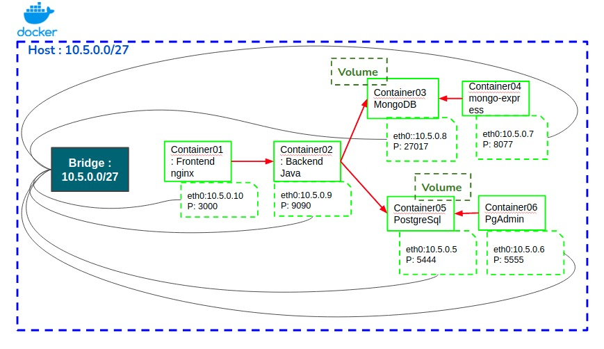
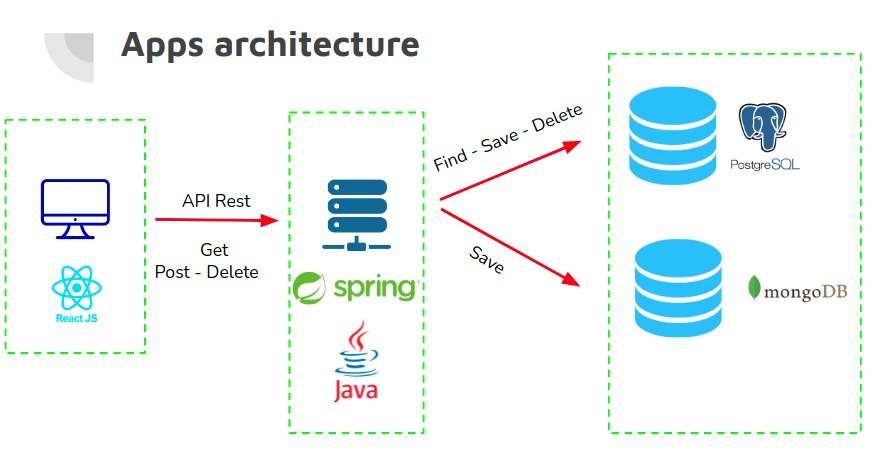

## Open source FORUM

### What is Open Source Forum ?

The goal of this project is to create an open source forum which is a simple web application that allows knowledge sharing (for example in big data field)

To access the forum, just choose a useraname and YOUHOUU :) ... you're free to publish what you want.

A user can post articles with hashtags, like, comment as well as delete articles

I used the following technos: ReactJS, Java 11, Spring Boot, PostgreSQL, MongoDB and Docker for the containerization

### Containerization using Docker

In **docker-compose.yaml** we find the configuration of the container that i have used :

- Bridge network which allows containers connected to the same bridge network to communicate, while providing isolation from containers which are not connected to that bridge network.
  
- Volumes for data persistence.
- Assignement of a port & an IP adress for each container.

Below is the architecture of containerization and the configuration of **docker-compose.yaml**

### App architecture

Below is the architecture of the application.

I used ReactJS for the FRONTEND and JAVA 11 with Spring Boot for the backend. I implemented API RESTFUL. I also used for the database part PostgreSQL and mongo DB.
 I choosed two different  databases (relational and non-relational) in order to test the persistence of data and how they are configured with docker.

 I used Hibernate which is an  ORM or object–relational mapping tool for the Java programming language. It provides a framework for mapping an object-oriented domain model to a relational database.

